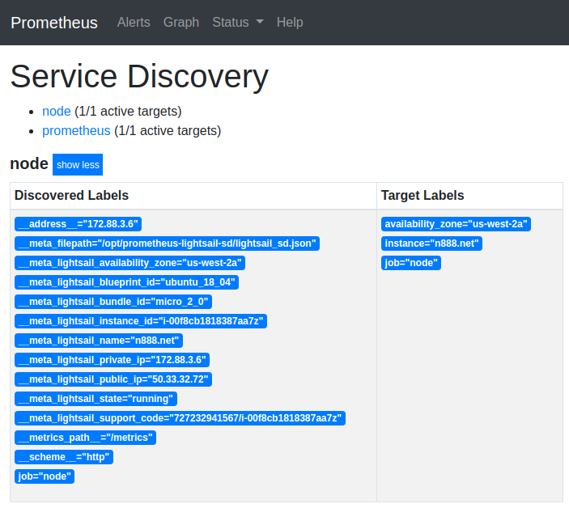

# prometheus-lightsail-sd
Service discovery for the [AWS Lightsail](https://aws.amazon.com/lightsail/) platform, compatible with [Prometheus](https://prometheus.io).

## ❗ Deprecation Notice ❗
This project has been integrated into upstream, as native service discovery: 

* https://prometheus.io/docs/prometheus/latest/configuration/configuration/#lightsail_sd_config
* https://github.com/prometheus/prometheus/pull/8693

Thanks to the Prometheus Dev Team.

## How it works

This service gets the list of servers from the Lightsail API and generates a file which is compatible with the Prometheus `file_sd` mechanism.

## Pre-requisites
### 1) IAM Policy

When using AWS credentials or IAM Roles, the following policy needs to be attached to the object:
```
{
    "Version": "2012-10-17",
    "Statement": [
        {
            "Effect": "Allow",
            "Action": [
                "lightsail:GetInstances"
            ],
            "Resource": [
                "*"
            ]
        }
    ]
}
```

### 2) AWS Credentials

* After attaching the policy above to the target object, authenticate using one of the three options:

#### 2a) AWS Named Profile

To use an AWS named profile, your profile config should be defined under `~/.aws/config` and `~/.aws/credentials`.

The profile name can be specified with either:
* Command line argument `--profile=myProfileName`
* Setting the environment variables `AWS_PROFILE=myProfileName` & `AWS_REGION=us-east-1`

More info: [AWS CLI - Named Profiles](https://docs.aws.amazon.com/cli/latest/userguide/cli-configure-profiles.html)

#### 2b) AWS IAM Key via Environment Variables

Set AWS IAM Key values via environment variables:
* Set the environment variables:
  * `AWS_ACCESS_KEY_ID`
  * `AWS_SECRET_ACCESS_KEY=EXAMPLEKEY`
  * `AWS_REGION=us-east-1`

#### 2c) IAM Role attached to instance

This tool supports AWS IAM Roles attached to instances, ie. running in EC2/ECS/etc.
* Note: Lightsail instances do not support IAM Roles, so you must use steps `2a` or `2b`.

## Installing it

Download the binary from the [Releases](https://github.com/n888/prometheus-lightsail-sd/releases) page.

## Running it

```
usage: prometheus-lightsail-sd [<flags>]

Tool to generate file_sd target files for AWS Lightsail.

Flags:
  -h, --help               Show context-sensitive help (also try --help-long and --help-man).
      --output.file="lightsail_sd.json"  
                           Output file for file_sd compatible file.
      --target.refresh=60  The refresh interval (in seconds).
      --profile=""         AWS Profile
      --web.listen-address=":9888"  
                           The listen address.
      --web.telemetry-path="/metrics"  
                           Path under which to expose metrics.
      --version            Show application version.
```

### Example output:

```
$ ./prometheus-lightsail-sd --profile=myProfileName
level=debug ts=2019-11-20T08:56:30.089673118Z caller=main.go:175 msg="loading profile: myProfileName"
level=debug ts=2019-11-20T08:56:30.089986153Z caller=manager.go:224 msg="Starting provider" provider=lightsailSD subs=[lightsailSD]
level=debug ts=2019-11-20T08:56:31.355158911Z caller=main.go:117 msg="get servers" count=2
level=debug ts=2019-11-20T08:56:31.355313346Z caller=main.go:123 msg="server added" source=lightsail/sccbc.net
level=debug ts=2019-11-20T08:56:31.355479273Z caller=main.go:123 msg="server added" source=lightsail/n888.net
```

### Prometheus /service-discovery example output


### Systemd service file example
See [examples/systemd/prometheus-lightsail-sd.service](examples/systemd/prometheus-lightsail-sd.service)

## Integration with Prometheus

Here is a Prometheus `scrape_config` snippet that configures Prometheus to scrape node_exporter (TCP/9100) on discovered instances:

```yaml
- job_name: node

  # This config assumes that prometheus and prometheus-lightsail-sd are started from the same directory:

  file_sd_configs:
  - files: [ "./lightsail_sd.json" ]

  # The relabeling does the following:
  # - overwrite the scrape address with the node_exporter's port.
  # - add the value of the instance's custom tag named "service".
  # - add the availability zone label.
  # - overwrite the instance label with the server's name.
  
  relabel_configs:
  - source_labels: [__meta_lightsail_private_ip]
    replacement: "${1}:9100"
    target_label: __address__
  - source_labels: [__meta_lightsail_tag_service]
    target_label: service
  - source_labels: [__meta_lightsail_availability_zone]
    target_label: availability_zone
  - source_labels: [__meta_lightsail_name]
    target_label: instance
```

The following meta labels are available on targets during relabeling:

* `__meta_lightsail_availability_zone="us-west-2a"`: availability zone
* `__meta_lightsail_blueprint_id="ubuntu_18_04"`: blueprint id (lightsail pre-baked image)
* `__meta_lightsail_bundle_id="nano_2_0"`: instance size
* `__meta_lightsail_instance_id="i-00f8cb1818387aa7z"`: instance id
* `__meta_lightsail_name="n888.net"`: instance name
* `__meta_lightsail_private_ip="172.88.3.6"` instance private ip
* `__meta_lightsail_public_ip="50.33.32.72"` instance public ip
* `__meta_lightsail_state="running"` instance state
* `__meta_lightsail_support_code="782236961567/i-00f8cb1818387aa7z"` instance support code
* `__meta_lightsail_tag_service="frontend"` instance tag, each tag gets its own label

```
note: lightsail.Instance does not return an InstanceId (unlike EC2), but does provide a "support code"
string with the format of "${lightsail_account_id}/${instance_id}". This string is split and the
${instance_id} value is assigned to the `instance_id` meta label.
```

## Building

`promu` is used for building (https://github.com/prometheus/promu):

Build current arch:
```
promu build
```

Build all archs under `.promu.yml`:
```
promu crossbuild
```

## Contributing

Pull requests, issues and suggestions are appreciated.

## Credits

* Prometheus Authors 
  * https://prometheus.io  
  * https://prometheus.io/blog/2018/07/05/implementing-custom-sd  
  * https://github.com/prometheus/prometheus/tree/master/discovery/ec2  
* Scaleway Service Discovery
  * Core code based on https://github.com/scaleway/prometheus-scw-sd  
* aws-sdk-go
  * https://aws.amazon.com/sdk-for-go  

## License

Apache License 2.0, see [LICENSE](https://github.com/n888/prometheus-lightsail-sd/blob/master/LICENSE).
